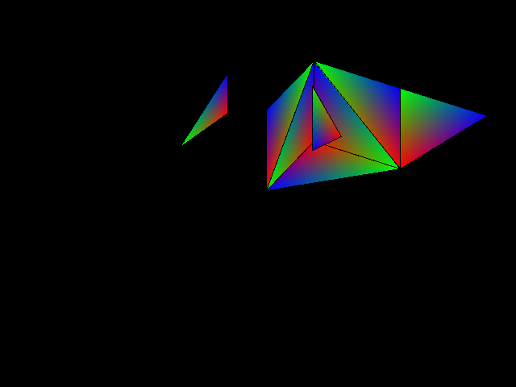

#isometric-raster
Uses multiple rasters of 2d triangles to create a 3d environment  

Creates a 3d environment from 2d rasters of triangles. This method allows for the rotation of a mesh from an isometric point of view, this projects a given mesh orthographically.  
This project still needs some more work as the triangles used to visualize are not being drawn in the correct order yet.
